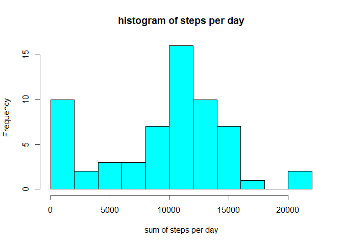
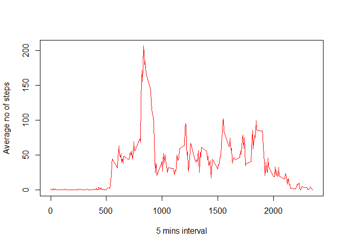
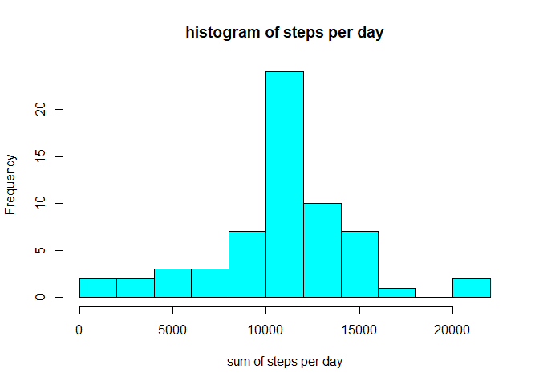
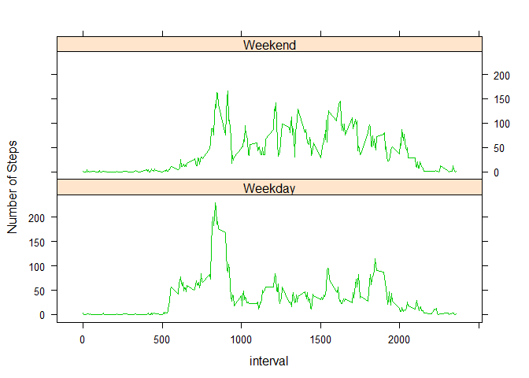

# Reproducible Research: Peer Assessment 1


## 1. Loading and preprocessing the data - Code for reading in the dataset and/or processing the data

```r
data <- read.csv("activity.csv", header = T, sep = ",")
```


## What is mean total number of steps taken per day?


```r
sum_of_steps <- tapply(data$steps, data$date, sum, na.rm=T)
```
## 2. Histogram of the total number of steps taken each day

```r
hist(sum_of_steps,breaks = 10, col=5,xlab = "sum of steps per day", main = "histogram of steps per day")
```

<!-- -->
##3.Mean and median number of steps taken each day 

```r
mean_sum_of_steps <- mean(sum_of_steps)
median_sum_of_steps <- median(sum_of_steps)
```

```r
print(c("mean of the total number of steps taken per daymean is:",mean_sum_of_steps, "median of the total number of steps taken per day is:",median_sum_of_steps))
```

```
## [1] "mean of the total number of steps taken per daymean is:"
## [2] "9354.22950819672"                                       
## [3] "median of the total number of steps taken per day is:"  
## [4] "10395"
```

## What is the average daily activity pattern?


```r
min_int <- tapply(data$steps, data$interval, mean, na.rm=T)
```
##4.Time series plot of the average number of steps taken

```r
plot(min_int ~ unique(data$interval), col=2,type="l", xlab = "5 mins interval",ylab="Average no of steps")
```

<!-- -->
##5. The 5-minute interval that, on average, contains the maximum number of steps

```r
max_no_of_steps_int<-min_int[which.max(min_int)]
```

```r
print(c("5 minute interval with max no of steps: ","No of steps:",max_no_of_steps_int))
```

```
##                                            
## "5 minute interval with max no of steps: " 
##                                            
##                             "No of steps:" 
##                                        835 
##                         "206.169811320755"
```
##6. Code to describe and show a strategy for imputing missing data

```r
step_missing_values<-sum(is.na(data$steps))
date_missing_values<-sum(is.na(data$date))
interval_missing_values<-sum(is.na(data$interval))
```

```r
print(c("step missing values:",step_missing_values,"date missing values:",date_missing_values,"interval missing values:",interval_missing_values))
```

```
## [1] "step missing values:"     "2304"                    
## [3] "date missing values:"     "0"                       
## [5] "interval missing values:" "0"
```


## Imputing missing values


```r
data1 <- data
for (i in 1:nrow(data)){
    if(is.na(data$steps[i])){
        data1$steps[i]<- min_int[[as.character(data[i, "interval"])]]
    }
}
```

```r
sum_of_steps1 <- tapply(data1$steps, data1$date, sum, na.rm=T)
```
##7. Histogram of the total number of steps taken each day after missing values are imputed

```r
hist(sum_of_steps1,breaks = 10, col=5,xlab = "sum of steps per day", main = "histogram of steps per day")
```

<!-- -->

```r
mean_sum_of_steps1 <- mean(sum_of_steps1)
median_sum_of_steps1 <- median(sum_of_steps1)
```

```r
print(c("mean of the total number of steps taken per daymean is:",mean_sum_of_steps1, "median of the total number of steps taken per day is:",median_sum_of_steps1))
```

```
## [1] "mean of the total number of steps taken per daymean is:"
## [2] "10766.1886792453"                                       
## [3] "median of the total number of steps taken per day is:"  
## [4] "10766.1886792453"
```
Observation
We can observe that both mean and median of imputed data are higher than the mean and median of raw data, suprisingly mean and median for the imputed data is same. 


## Are there differences in activity patterns between weekdays and weekends?

```r
data1$date<-as.Date(data1$date)
```

```r
data1$day <- as.factor(weekdays(data1$date))
```

```r
data1$weekday <- ifelse(!(data1$day %in% c("Saturday","Sunday")), TRUE, FALSE) 
```


```r
weekdays_data <- data1[data1$weekday,]
steps_per_interval_weekdays <- aggregate(weekdays_data$steps, by=list(interval=weekdays_data$interval), FUN=mean)
```


```r
weekends_data <- data1[!data1$weekday,]
steps_per_interval_weekends <- aggregate(weekends_data$steps, by=list(interval=weekends_data$interval), FUN=mean)
```

```r
colnames(steps_per_interval_weekdays) <- c("interval", "average_steps")
colnames(steps_per_interval_weekends) <- c("interval", "average_steps")
#Adding a column to indecate the day
steps_per_interval_weekdays$day <- "Weekday"
steps_per_interval_weekends$day <- "Weekend"
```

```r
week_data <- rbind(steps_per_interval_weekends, steps_per_interval_weekdays)
#Converting the day variabke to a factor
week_data$day <- as.factor(week_data$day)
```
##8.Panel plot comparing the average number of steps taken per 5-minute interval across weekdays and weekends

```r
library(lattice)
xyplot(average_steps ~  interval | day, data = week_data, col=3,layout = c(1,2), type ="l", ylab="Number of Steps")
```

<!-- -->
